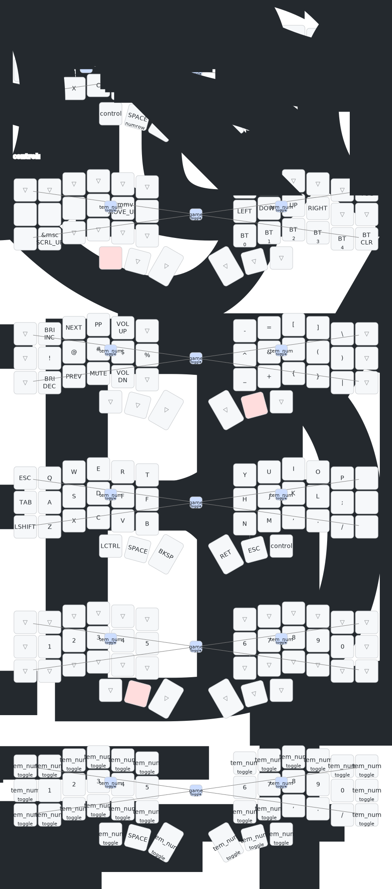

# ZSH Config

A repo containing the configuration for my custom keyboard(s).
Build with `./bin/build.sh` (requires a working [ZMK](https://zmk.dev) installation).
*SETUP*: run `./bin/setup.sh` after cloning.

## Aurora Corne

<small>Image generated using [Keymap Drawer](https://pypi.org/project/keymap-drawer/#command-line-tool-installation). Render with `./bin/render.sh [--open]`</small>

A split, orthogonal 6-columnar keyboard from [SplitKB](https://splitkb.com).

